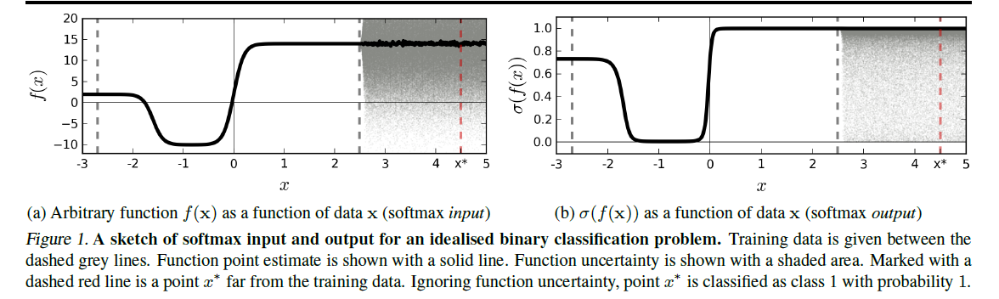
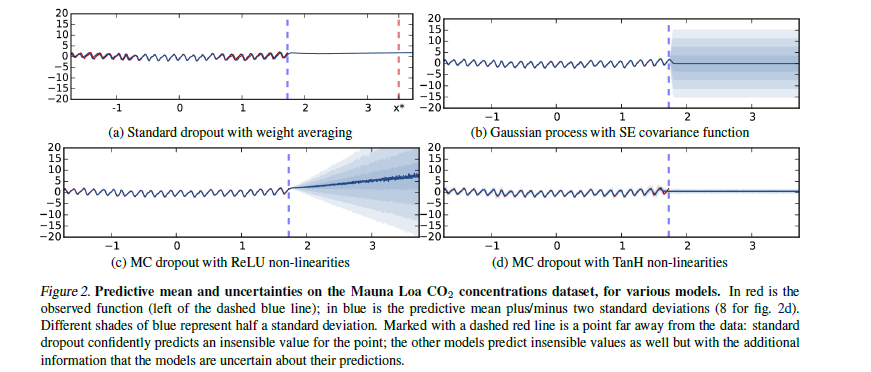
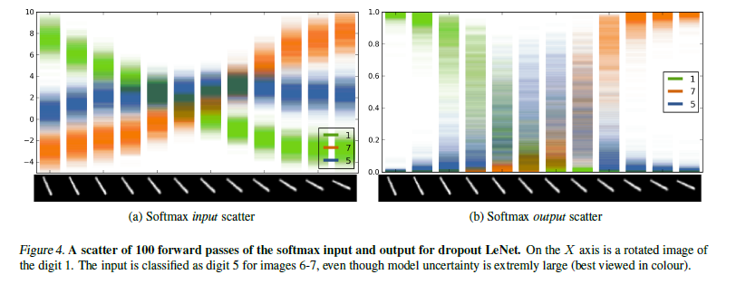
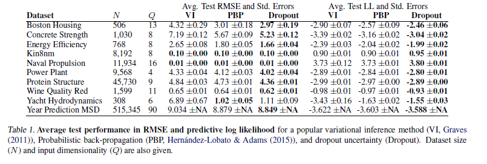

#! https://zhuanlan.zhihu.com/p/274665650

 (Title) 

# Dropout as a Bayesian Approximation: Representing Model Uncertainty in Deep Learning

 (Contributions) 

In this paper we develop a new theoretical framework casting dropout training in deep neural networks (NNs) as approximate Bayesian inference in deep Gaussian processes.

We show that the dropout objective, in effect, minimises the Kullback–Leibler divergence between an approximate distribution and the posterior of a deep Gaussian process

---
 (Ready work) 

## uncertainty

passing the distribution (shaded area 1a) through a softmax (shaded area 1b) better reflects classification uncertainty far from the training data.

## Dropout
$$
\mathcal{L}_{\text {dropout }}:=\frac{1}{N} \sum_{i=1}^{N} E\left(\mathbf{y}_{i}, \widehat{\mathbf{y}}_{i}\right)+\lambda \sum_{i=1}^{L}\left(\left\|\mathbf{W}_{i}\right\|_{2}^{2}+\left\|\mathbf{b}_{i}\right\|_{2}^{2}\right)
$$

How to estimate $\hat y_{i}$?

$$
p(\mathbf{y} \mid \mathbf{x}, \mathbf{X}, \mathbf{Y})=\int p(\mathbf{y} \mid \mathbf{x}, \boldsymbol{\omega}) p(\boldsymbol{\omega} \mid \mathbf{X}, \mathbf{Y}) \mathrm{d} \boldsymbol{\omega}
$$

$$
\begin{aligned}
\hat{\mathbf{y}}(\mathrm{x}, \omega=\{&\left.\left.\mathbf{W}_{1}, \ldots, \mathbf{W}_{L}\right\}\right) \\
&=\sqrt{\frac{1}{K_{L}}} \mathbf{W}_{L} \sigma\left(\ldots \sqrt{\frac{1}{K_{1}}} \mathbf{W}_{2} \sigma\left(\mathbf{W}_{1} \mathbf{x}+\mathbf{m}_{1}\right) \ldots\right)
\end{aligned}
$$

$p(w|\mathrm{X},\mathrm{Y})$ is intractable, we use $q(w)$ and KL-divergence to approximate $p(w|\mathrm{X},\mathrm{Y})$.

We define $q(w)$ as:
$$
\begin{array}{l}
\mathbf{W}_{i}=\mathbf{M}_{i} \cdot \operatorname{diag}\left(\left[\mathbf{z}_{i, j}\right]_{j=1}^{K_{i}}\right) \\
\mathbf{z}_{i, j} \sim \text { Bernoulli }\left(p_{i}\right) \text { for } i=1, \ldots, L, j=1, \ldots, K_{i-1}
\end{array}
$$

objective function:
$$
-\int q(\omega) \log p(\mathbf{Y} \mid \mathbf{X}, \boldsymbol{\omega}) \mathrm{d} \omega+\operatorname{KL}(q(\boldsymbol{\omega}) \| p(\boldsymbol{\omega}))
$$

The optimization details are in paper arXiv:1506.02157
- *Dropout as a Bayesian Approximation: Appendix arXiv:1506.02157*

## Obtaining Model Uncertainty
Approximate predictive distribution
$$
q\left(\mathbf{y}^{*} \mid \mathbf{x}^{*}\right)=\int p\left(\mathbf{y}^{*} \mid \mathbf{x}^{*}, \boldsymbol{\omega}\right) q(\boldsymbol{\omega}) \mathrm{d} \boldsymbol{\omega}
$$

Expection estiamtes:
$$
\mathbb{E}_{q\left(\mathbf{y}^{*} \mid \mathbf{x}^{*}\right)}\left(\mathbf{y}^{*}\right) \approx \frac{1}{T} \sum_{t=1}^{T} \widehat{\mathbf{y}}^{*}\left(\mathbf{x}^{*}, \mathbf{W}_{1}^{t}, \ldots, \mathbf{W}_{L}^{t}\right)
$$

Second moment:
$$
\begin{array}{l}
\mathbb{E}_{q\left(\mathbf{y}^{*} \mid \mathbf{x}^{*}\right)}\left(\left(\mathbf{y}^{*}\right)^{T}\left(\mathbf{y}^{*}\right)\right) \approx \tau^{-1} \mathbf{I}_{D} \\
\quad+\frac{1}{T} \sum_{t=1}^{T} \widehat{\mathbf{y}}^{*}\left(\mathbf{x}^{*}, \mathbf{W}_{1}^{t}, \ldots, \mathbf{W}_{L}^{t}\right)^{T} \widehat{\mathbf{y}}^{*}\left(\mathbf{x}^{*}, \mathbf{W}_{1}^{t}, \ldots, \mathbf{W}_{L}^{t}\right)
\end{array}
$$

==>
$$
\begin{array}{l}
\mathbb{Var}_{q\left(\mathbf{y}^{*} \mid \mathbf{x}^{*}\right)}\left(\mathbf{y}^{*}\right) \approx \tau^{-1} \mathbf{I}_{D} \\
\quad+\frac{1}{T} \sum_{t=1}^{T} \widehat{\mathbf{y}}^{*}\left(\mathbf{x}^{*}, \mathbf{W}_{1}^{t}, \ldots, \mathbf{W}_{L}^{t}\right)^{T} \widehat{\mathbf{y}}^{*}\left(\mathbf{x}^{*}, \mathbf{W}_{1}^{t}, \ldots, \mathbf{W}_{L}^{t}\right) \\ \quad -\mathbb{E}_{q\left(\mathbf{y}^{*} \mid \mathbf{x}^{*}\right)}\left(\mathbf{y}^{*}\right)^{T}\mathbb{E}_{q\left(\mathbf{y}^{*} \mid \mathbf{x}^{*}\right)}\left(\mathbf{y}^{*}\right)
\end{array}
$$

==>
$$
logP(y^{*}|x^{*},X,Y)\approx logsumexp(-\frac{1}{2} \tau ||y-\hat{y}||^{2})-logT-\frac{1}{2}log2\pi-\frac{1}{2}log\tau^{-1}
$$

where

$\tau = \frac{pl^{2}}{2N\lambda}$

---
 (Show work) 

experiments on dropout LeNet

> This signifies the
model’s uncertainty in its softmax output value – i.e. in the
prediction. In this scenario it would not be reasonable to
use probit to return class 5 for the middle image when its
uncertainty is so high. One would expect the model to ask
an external annotator for a label for this input. Model uncertainty
in such cases can be quantified by looking at the
entropy or variation ratios of the model prediction.

error experiments

Dropout outperform than other methods, however, it maybe slightly slower.
---
 (Conclusion) 

## future works

The distribution dropout of paper is main Bernoulli dropout. Other variants of dropout would result in different uncertainty estiamtes, trading-off uncertainty quality with computational complexity.

***Furthermore, each GP covariance function has a one-toone
correspondence with the combination of both NN nonlinearities and weight regularisation. This suggests techniques
to select appropriate NN structure and regularisation
based on our a priori assumptions about the data. For
example, if one expects the function to be smooth and
the uncertainty to increase far from the data, cosine nonlinearities
and L2 regularisation might be appropriate. The
study of non-linearity–regularisation combinations and the
corresponding predictive mean and variance are subject of
current research.***0