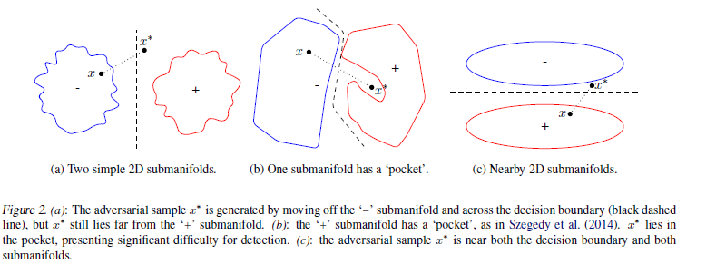
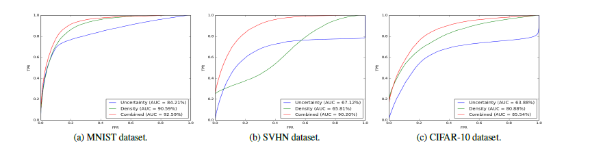

#! https://zhuanlan.zhihu.com/p/273684170

 (Title) 

# Dropout as a Bayesian Approximation:Representing Model Uncertainty in Deep Learning 

 (Contributions) 

In this paper we develop a new theoretical framework casting dropout training in deep neural networks (NNs) as approximate Bayesian inference in deep Gaussian processes.

---

---
 (Ready work) 

## manifold

If $x^{*}$ lies off of the data manifold, we may split into three possible situations:

1. $x^{*}$ is far away from the submanifold of $c_{x^{*}}$ .

2. $x^{*}$ is near the submanifold $c_{x^{*}}$ but not on it, and $x^{*}$ is far from the classification boundary separating classes $c_{x}*$ and $c_{x^{*}}$ .

3. $x^{*}$ is near the submanifold $c_{x^{*}}$ but not on it, and $x^{*}$ is near the classification boundary separating classes $c_{x}$ and $c_{x^{*}}$ .

## Density Estimation 

The standard technique of kernel density estimation can, given the point $x$ and the set $X_{t}$ of training points with label $t$, provide a density estimate $\hat{f}(x)$ that can be used as a measure of how far $x$ is from the submanifold for $t$. 
$$
\hat{f}(x)=\frac{1}{|X_{t}|}\sum_{x_{i} \in X_{t}}k(x_{i}, x)
$$
where $k(\cdot, \cdot)$ is kernel function, often chosen as a Gaussian with bandwidth $\sigma$
$$
k_{\sigma}(x,y) = exp(-||x-y||^{2}/\sigma^{2]})
$$

==>
$$
\hat{K}(x,X_{t})=\sum_{x_{i} \in X_{t}}k_{\sigma}(\phi(x_{i}), \phi(x))
$$

## Bayesian Neural Network Uncertainty 
Recently, Gal & Ghahramani (2015) proved that DNNs trained with dropout are equivalent to an approximation of the deep Gaussian process
- *Gal, Y. and Ghahramani, Z. Dropout as a Bayesian approximation:
representing model uncertainty in deep learning. In Proceedings of The 33rd International Conference on Machine Learning (ICML ’16), pp. 1050–1059, 2015.*
(more details)

As result, we can extract Bayesian uncertainty estimates from a wide range of DNN architectures without modification.

Expection:
$$\mathbb{E}_{q\left(y^{*} \mid x^{*}\right)}\left[y^{*}\right] \approx \frac{1}{T} \sum_{i=1}^{T} \hat{y}^{*}\left(x^{*}, W^{t}\right)$$

Variance:
$$\begin{aligned}
\mathbb{V}_{q\left(y^{*} \mid x^{*}\right)}\left[y^{*}\right] \approx & \tau^{-1} I_{D} \\
&+\frac{1}{T} \sum_{i=1}^{T} \hat{y}^{*}\left(x^{*}, W^{t}\right)^{T} \hat{y}^{*}\left(x^{*}, W^{t}\right) \\
&-\mathbb{E}_{q\left(y^{*} \mid x^{*}\right)}\left[y^{*}\right]^{T} \mathbb{E}_{q\left(y^{*} \mid x^{*}\right)}\left[y^{*}\right]
\end{aligned}$$

==>
$$U\left(x^{*}\right)=\frac{1}{T} \sum_{i=1}^{T} \hat{y}_{i}^{*} \hat{y}_{i}^{*}-\left(\frac{1}{T} \sum_{i=1}^{T} \hat{y}_{i}^{*}\right)^{T}\left(\frac{1}{T} \sum_{i=1}^{T} \hat{y}_{i}^{*}\right)$$

---
 (Show work) 

- *uncertainty* : this classifier simply thresholds on
the uncertainty value of a sample.
- *density* : this classifier simply thresholds on the
negative log kernel density of a sample.
- *combined* : this is a simple logistic regression classifier
with two features as input: the uncertainty and
the density estimate.

---
 (Conclusion) 

We have shown that adversarial samples crafted to fool
DNNs can be effectively detected with two new features:
kernel density estimates in the subspace of the last hidden layer, and Bayesian neural network uncertainty estimates.