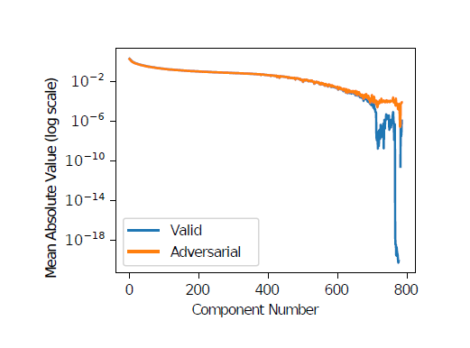

#! https://zhuanlan.zhihu.com/p/272709033
 (Title) 

# Adversarial Examples Are Not Easily Detected: Bypassing Ten Detection Methods

 (Contributions) 

We make the following contributions:
1. We find that many defenses are unable to detect adversarial examples, even when the attacker is oblivious to the
specific defense used.
2. We break all existing detection methods in the white-box
(and black-box) setting by showing howto pick good attackerloss
functions for each defense.
3. We draw conclusions about the space of adversarial examples,
and offer a note of caution about evaluating solely
on MNIST; it appears that MNIST has somewhat different
security properties than CIFAR.
4. We provide recommendations for evaluating defenses.
---
> The author always claimed that FGSM and JSMA is too weak to evaluation whether a detection method is better.

>Why?

>Answer : We re-implement these two defenses  and find that adversarial retraining is able to detect adversarial examples when generated with the fast gradient sign and JSMA attacks with near-100% accuracy.

> - *On the (Statistical) Detection of Adversarial Examples.
arXiv preprint arXiv:1702.06280 (2017).*
> - *Adversarial and Clean Data
Are Not Twins. arXiv preprint arXiv:1704.04960 (2017).*

---
 (Ready work) 

###  Three attack methods

1. A strong attack (Zero-Knowledge):
2. An adaptive, white-box attack (Perfect-Knowledge)
3. A black-box attack (Limited-Knowledge):

###  Attack method 
- C&W method

###  Defence methods 

> - Grosse *On the (Statistical) Detection of Adversarial Examples. arXiv preprint arXiv:1702.06280 (2017).*
> - Gong *Adversarial and Clean Data
Are Not Twins. arXiv preprint arXiv:1704.04960 (2017).*
> - Metzen *On Detecting Adversarial Perturbations. In International Conference on Learning Representations. arXiv preprint arXiv:1702.04267.*
> - Hendrycks *Early Methods for Detecting Adversarial
Images. In International Conference on Learning Representations*
> - Bhagoji  *Dimensionality Reduction as a Defense against Evasion Attacks on Machine 
> - Li  *Adversarial Examples Detection in Deep Networks with Convolutional Filter Statistics. arXiv preprint arXiv:1612.07767 (2016).* 
> - Grosse  *On the (Statistical) Detection of Adversarial Examples. arXiv preprint arXiv:1702.06280 (2017).* 
> - Feinman  *Adversarial Samples from Artifacts. arXiv preprint arXiv:1703.00410
(2017).* (need to read)
---
 (Show work) 

## Zero-Knowledge

- Grosse and Gong methods
  
    Grosse and Gong methods perform well on MNIST, but not on CIFAR10. 

- Metzen method

    High false positive rate on Metzen method 

- Hendrycks method

    As for Hendrycks claimed(Input Image PCA), there is no difference on the first principal components, but there is a substantial difference between natural and adversarial instances on the later components.

    

    This method seems perfect, however, the reason is because of MNIST itself. ***the detected difference between the natural and adversarial examples is because the border pixels are nearly always zero for natural MNIST instances, whereas typical adversarial examples have non-zero values on the border.***

- Bhagoji method

    pass

- Li method
    
    pass

- Grosse method

    MMD method is not powerful as we thinking.
    >*MMD* is one of the most powerful multidimensional statistical tests 

- Feinman method

    Feinman’s defense is able to detect C&W adversarial examples on MNIST, but not on CIFAR

## Perfect-Knowledge

- Grosse method
  
  Use C&W directly(less distortion)

-  Gong method 
  
  Define a function 
    $$
    G(x)_{i} = \left\{
        \begin{aligned}  
        Z_{F}(x)_{i} & &i <=N \\
        (Z_{D}+1)*max_{j}Z_{F}(x)_{j} & &i=N+1        \end{aligned}
        \right.
    $$
    Now we treat this function G as if it were a neural network, and feed it directly into C&W’s attack algorithm instead of the function $Z$. It is easy to see that if an instance $x ′$ is classified by $G$ as label $l ≤ N$ then both $C(x ′) = l$ and the detector classifies $x ′$ as natural (non-adversarial). This approach successfully generates adversarial examples against Gong’s defense with 100% success.

-  Metzen method 
  
    Generate adversarial examples using C&W’s attack applied to the same function $G(·)$ defined in Gong

- Hendrycks method
    
    We can generate adversarial examples that are restricted to change only the first k principal components and these adversarial examples that are not detected by the Hendrycks defense.

- Bhagoji method

    This approach is no more robust than an unsecured convolutional network

- Li method
    
    pass

- Grosse method

    pass

- Feinman method
    $$K D E(x)=\frac{1}{\left|X_{t}\right|} \sum_{s \in X_{t}} \exp \left(\frac{\left|F^{n-1}(x)-F^{n-1}(s)\right|^{2}}{\sigma^{2}}\right)$$
    Define a new loss function
    $$
    ||x-x'||_{2}^{2}+c*(l(x')+l_{2}(x'))
    $$

    where

    $$
    l_{2}(x')=max(-log(KDE(x'))-\epsilon, 0)
    $$

    Another method

    $$U(x)=\left(\frac{1}{L} \sum_{i=1}^{L}\left\|F_{r}(x)\right\|\right)-\left\|\frac{1}{L} \sum_{i=1}^{L} F_{r}(x)\right\|$$

    pass

## Limited-Knowledge

Split the training set in half. First half is known to the attacker and the second half is used by the defender to train their network. Then apply the C&W attack to each instance in the test set to generate adversarial examples for $R_{1}$ (model trained on first half dataset), and we test whether they fool $R_{2}$ (the other half one).

> **In fact this is transfering attacking**

---
 (Conclusion) 

## Properties of adversarial examples
1. **Randomization can increase required distortion**
2. MNIST properties may not hold on CIFAR.
3. Detection neural networks can be bypassed.
4. **Operating on raw pixel values is ineffective.**

## Recommendations
1. Evaluate using a strong attack
2. Demonstrate white-box attacks fail.
3. Report false positive and true positive rates.
4. Evaluate on more than MNIST.

